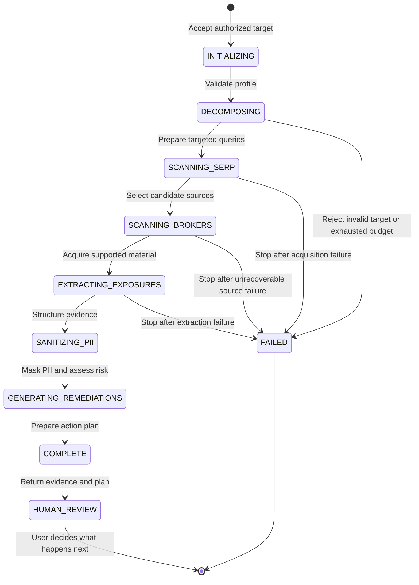
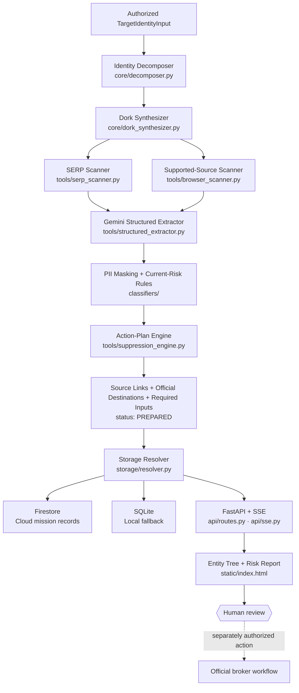

# Project Umbra — System Architecture


The editable vector source lives at [`docs/architecture-diagram.svg`](docs/architecture-diagram.svg).

## Architecture goal

Umbra turns an authorized identity profile into a source-linked Risk Report and an approval-ready action plan. The architecture automates investigation and evidence organization while keeping external action under human control.

## Mission lifecycle



A configurable step budget and timeout bound the mission. The execution manager preserves partial state when the workflow stops or fails.

## Component flow



The production dependency factory ends at action-plan generation. It does not call external dispatch methods.

## Google services

- **Google GenAI SDK (`google-genai`)** invokes Gemini 3.7 Flash for structured extraction in the configured production pipeline.
- **Cloud Run** hosts the FastAPI service and background mission runtime.
- **Firestore** stores cloud mission state, telemetry, findings, and action records.
- **Google ADK does not run the orchestration layer.** The finite-state mission controller owns orchestration.
- **The default PII classifier uses deterministic rules.** Umbra does not claim neural Gemma execution unless a separately configured and verified runtime enables it.

## Provenance modes

| Provenance | Behavior | What it establishes |
|---|---|---|
| `live` | Uses the configured production services and records provider/model metadata | Evidence that the authorized mission used the reported runtime |
| `controlled_fixture` | Runs the pipeline against labeled synthetic source material | Reproducible parsing, correlation, assessment, and planning behavior |
| `scripted_demo` | Replays deterministic synthetic events through `/stream` | Product experience and UI behavior |

The guided Avery Mercer path uses a fictional identity and a scripted replay. It demonstrates the product without exposing real PII or depending on unstable third-party pages.

## Access and privacy boundary

```text
PUBLIC                                  PROTECTED
/, /static/*, /stream                   POST /api/v1/scan
/api/v1/health                          authorized production access
                                                     │
                                                     ▼
                                      mission-scoped access capability
                                                     │
                                                     ▼
                              /scan/{id}, /events, /findings, /receipts
                                       accepted mission only

                         Global mission and receipt collections
                                      privileged access only
```

- The public replay cannot start a production investigation.
- Production mission creation requires configured authorization.
- The accepted mission receives a scoped capability and an HttpOnly, `SameSite=Strict` cookie.
- Mission routes accept only authorized or mission-scoped access. The API never places capability values in URLs.
- Global collections remain privileged to prevent public case enumeration.
- API summaries clear the reversible redaction map and replace original detected PII with `[REDACTED]`.
- Credentials, capabilities, account details, and real PII stay out of public copy, screenshots, recordings, browser history, and logs.

## Execution evidence

A trustworthy production record correlates one mission across:

```text
accepted mission
   ├── protected API result and event stream
   ├── Cloud Run request and lifecycle logs
   ├── Gemini provider and model metadata
   ├── Firestore mission and finding records
   └── rendered Risk Report and action plan
```

The public documentation describes this evidence model without publishing operational mission identifiers, access values, internal account details, or raw PII.

## Interface model

The Entity Tree connects four branches:

```text
                         TARGETED QUERIES
                                │
PUBLIC SOURCES ─────── AUTHORIZED TARGET ─────── STRUCTURED EVIDENCE
                                │
                     APPROVAL-READY ACTIONS
```

- Mission events reveal nodes over SSE.
- Selecting a node opens its source, evidence, confidence, or next-action context.
- The Risk Report shows current exposure and action coverage.
- Prepared hashes protect evidence and plan integrity; they do not represent broker receipts.

## Reliability boundaries

- The mission controller enforces step budgets, timeouts, cancellation, and explicit terminal states.
- The storage resolver supports Firestore and SQLite without changing the domain contract.
- Pydantic schemas validate model-assisted extraction before downstream use.
- Controlled fixtures make source parsing reproducible when public sites block automated traffic.
- The interface labels fixture and replay provenance instead of presenting it as live browsing.

## Responsible-use boundary

- Investigate only user-owned or explicitly authorized identities.
- Confirm source matches before acting.
- Review the official broker process and applicable law before submission.
- Require human approval for external action.
- Re-scan after an approved action before claiming reduced exposure.
