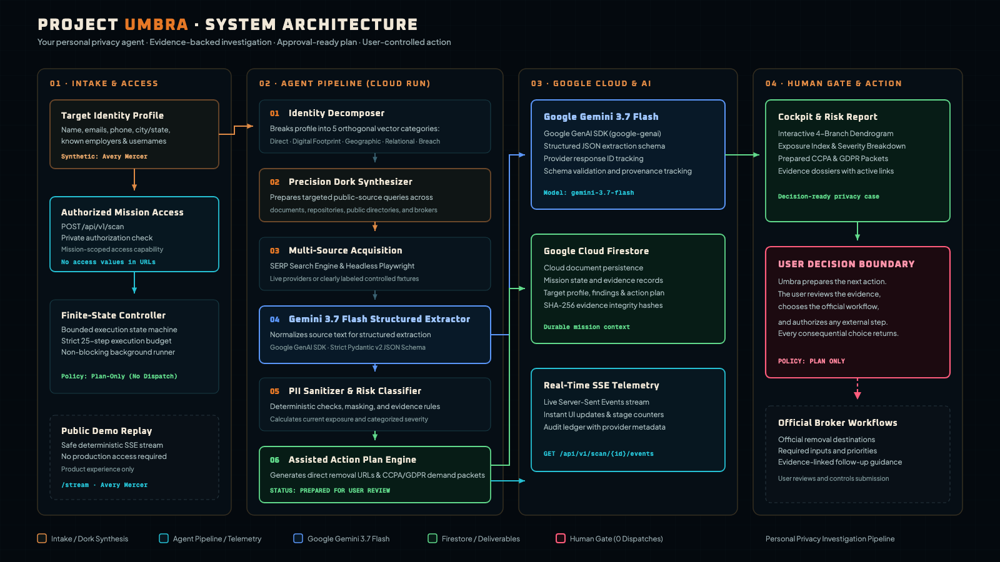

# Project Umbra

**Project Umbra deploys your personal privacy agent to protect your identity in a digital world built to collect it.**

Umbra turns a scattered digital footprint into one clear, evidence-backed plan. Give it an identity profile you own or have permission to investigate, and it shows where that identity appears, why the findings belong together, which exposures matter most, and what you can do next.

The user keeps control of every consequential action. Umbra investigates, organizes the evidence, and prepares broker-specific next steps. It does not represent a prepared plan as a submitted request, confirmed deletion, or reduced exposure.



## The outcome

An authorized mission returns:

- a connected view of public identity exposure across supported sources;
- source-linked findings that explain each match;
- a Risk Report that separates current exposure from future action;
- a prioritized broker-by-broker plan with official destinations and required inputs;
- a durable mission record for review and follow-up.

## How it works

```text
Authorized identity profile
        ↓
Targeted public-source investigation
        ↓
Gemini-structured, source-linked evidence
        ↓
Current-risk assessment
        ↓
Broker-specific action plan
        ↓
Human review before external action
```

The mission controller runs asynchronously, enforces a step budget and timeout, streams progress with Server-Sent Events, and persists the result.

The production stack uses:

- Gemini 3.7 Flash through the Google GenAI SDK for structured extraction;
- Cloud Run for the hosted application and mission runtime;
- Firestore for cloud mission records;
- FastAPI, Pydantic, Playwright, and Server-Sent Events;
- SQLite as a local persistence fallback.

Umbra also implements and tests an optional Gemma 2 9B IT path for neural PII classification. The production configuration uses deterministic classification for a predictable privacy boundary.

See [ARCHITECTURE.md](ARCHITECTURE.md) for the component model, execution modes, access policy, and trust boundaries.

## Trust boundary

- Investigate only an identity you own or have explicit permission to assess.
- Treat every match as evidence to verify, not unquestionable identity truth.
- Keep production mission data private and access scoped to the accepted mission.
- Remove reversible PII before returning mission summaries through the API.
- Require human review before any external broker action.
- Re-scan after an approved action before claiming reduced exposure.

The public walkthrough uses the fictional Avery Mercer identity. Controlled fixtures support reproducible parsing and testing. Neither is presented as proof of a live production mission.

## Local setup

### Requirements

- Python 3.12+
- Chromium installed through Playwright
- A Gemini API key for live structured extraction
- Optional Google Cloud credentials for Firestore

### Install and run

```bash
git clone https://github.com/shifujosh/project-umbra.git
cd project-umbra

python3.12 -m venv .venv
source .venv/bin/activate
python -m pip install -e '.[dev]'
python -m playwright install chromium

cp .env.example .env
python -m uvicorn project_umbra.api.app:app --reload --host 0.0.0.0 --port 8000
```

Open `http://localhost:8000` for the controlled synthetic walkthrough.

For a fully local deterministic run, use:

```dotenv
PERSISTENCE_MODE=sqlite
SERP_MODE=mock
PLAYWRIGHT_SIMULATION_MODE=true
PII_CLASSIFIER_MODE=heuristic
```

Set `GEMINI_API_KEY` privately for live Gemini extraction. Never commit `.env` or put credentials in URLs, screenshots, logs, or recordings.

## Tests

```bash
.venv/bin/python -m pytest
```

The public suite covers mission control, acquisition modes, extraction, PII handling, action-plan generation, access control, persistence, API behavior, deployment contracts, and the product interface.

## Google Cloud deployment

Authenticate with Google Cloud, choose a project you control, and run:

```bash
export GCP_PROJECT_ID="your-gcp-project-id"
bash deploy_cloud_run.sh
```

The deployment script configures Cloud Run, Gemini 3.7 Flash, Firestore, Artifact Registry, Cloud Build, Secret Manager, IAM, Cloud Logging, and plan-only external-action behavior. Review the generated service configuration before sharing access.

## How it was made

Project Umbra used specialized Google AI and cloud tools across concept development, coordinated agent creation, runtime intelligence, media production, deployment, security, and persistence. The concise [creation story](HOW_IT_WAS_MADE.md) documents that process, the optional Gemma experiment, supporting tools, and what did not run in production.

## License

Project Umbra is available under the [MIT License](LICENSE).
